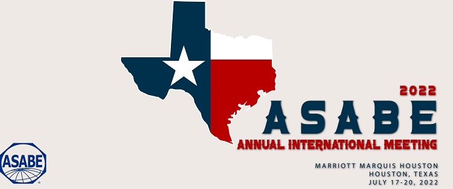

### Topic: Computer-aided design and optimization of a shake-catch soft fruit harvester
Tree fruit harvesting is both time-sensitive and demanding, leaving tree fruit growers susceptible to seasonal labor shortages. To minimize fruit damage during shake-catch harvesting, we suggest employing multi-level fruit catching (MFC) systems. These systems consist of closely spaced, soft rods arranged at multiple heights. Across various mechanical design applications, computer-aided design (CAD) modeling tools have proven invaluable for rapid design refinement and cost-effective prototyping. In this study, we introduce an innovative CAD approach to determine the ideal number of layers that maximizes marketable fruit collection efficiency in MFC systems, defined as the percentage of collected fruits with acceptable bruising levels.

