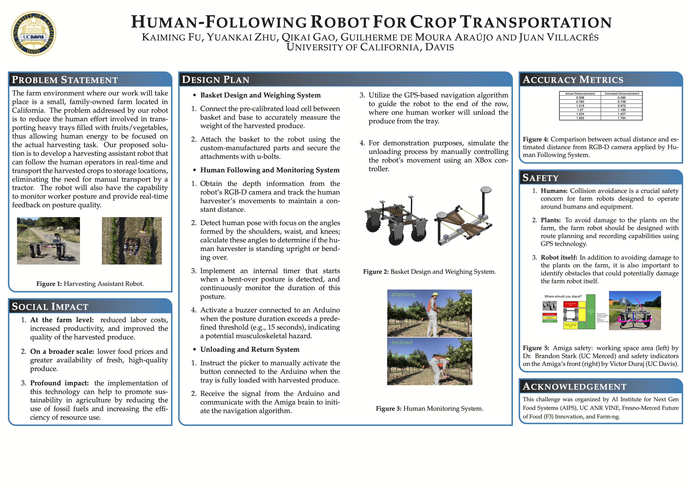

### Topic: Human-following Robot for Crop Transportation
The farm environment where our work will take place is a small, family-owned farm located in California. The problem addressed by our robot is to reduce the human effort involved in trans- porting heavy trays filled with fruits/vegetables, thus allowing human energy to be focused on the actual harvesting task. Our proposed solu- tion is to develop a harvesting assistant robot that can follow the human operators in real-time and transport the harvested crops to storage locations, eliminating the need for manual transport by a tractor. The robot will also have the capability to monitor worker posture and provide real-time feedback on posture quality. 

