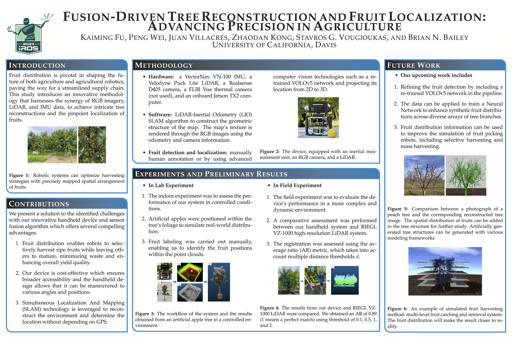
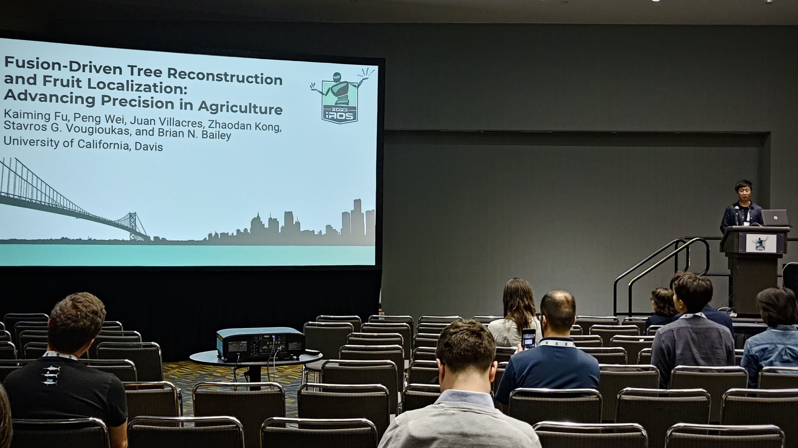
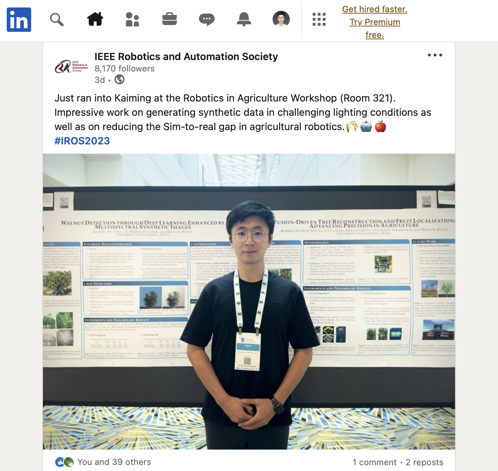

### Topic: Fusion-Driven Tree Reconstruction and Fruit Localization: Advancing Precision in Agriculture
Fruit distribution is pivotal in shaping the future of both agriculture and agricultural robotics, paving the way for a streamlined supply chain. This study introduces an innovative methodology that harnesses the synergy of RGB imagery, LiDAR, and IMU data, to achieve intricate tree reconstructions and the pinpoint localization of fruits.

