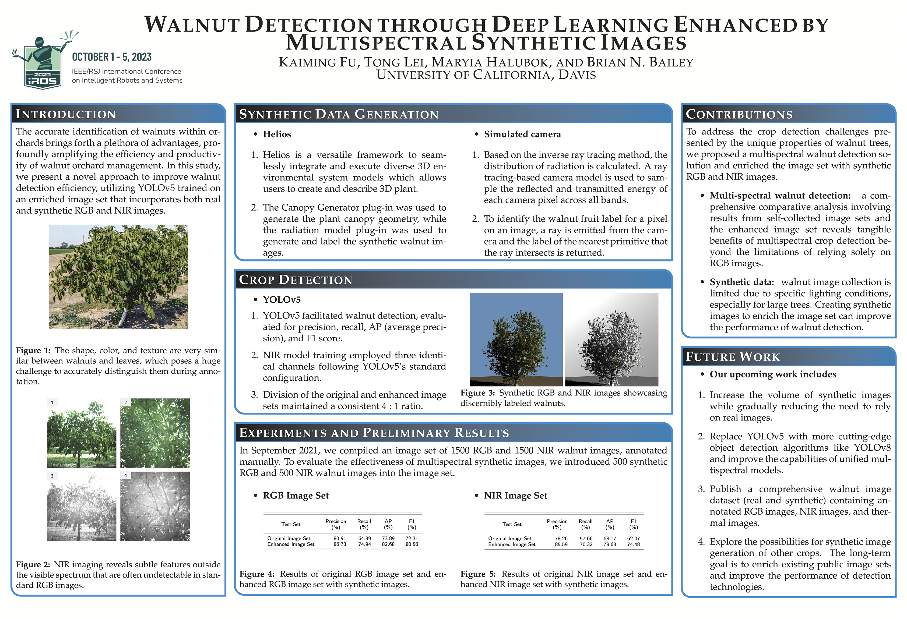

### Topic: Walnut Detection Through Deep Learning Enhanced by Multispectral Synthetic Images

###### The accurate identification of walnuts within or- chards brings forth a plethora of advantages, pro- foundly amplifying the efficiency and productiv- ity of walnut orchard management. In this study, we present a novel approach to improve walnut detection efficiency, utilizing YOLOv5 trained on an enriched image set that incorporates both real and synthetic RGB and NIR images.

